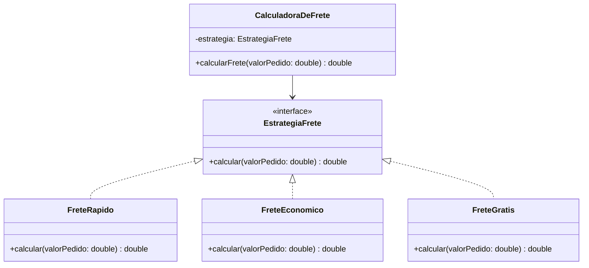

# Strategy Pattern

> Padrão comportamental que permite definir uma família de algoritmos, encapsular cada um deles em uma classe separada e trocá-los em tempo de execução — sem que o código que os utiliza precise saber qual implementação está por trás.

---

## 🎯 O problema que ele resolve

Imagine um sistema de cálculo de frete. Sem o Strategy, é comum ver algo assim:

```java
public class CalculadoraDeFrete {

    public double calcular(double valorPedido, String tipoFrete) {
        if (tipoFrete.equals("RAPIDO")) {
            return valorPedido * 0.15 + 20;
        } else if (tipoFrete.equals("ECONOMICO")) {
            return valorPedido * 0.05 + 5;
        } else if (tipoFrete.equals("GRATIS")) {
            return 0;
        }
        throw new IllegalArgumentException("Tipo de frete inválido");
    }
}
```

**Por que isso é um problema?**

- Toda vez que surge um novo tipo de frete, você precisa **alterar** essa classe (viola o Open/Closed Principle: o código deveria estar aberto para extensão, mas fechado para modificação).
- A classe acumula responsabilidade demais: ela conhece as regras de **todos** os tipos de frete.
- Fica fácil introduzir bugs em uma regra ao mexer em outra, já que tudo está misturado no mesmo método.

---

## ✅ A solução com Strategy

A ideia é simples: **cada regra de cálculo vira uma classe própria**, todas implementando a mesma interface. A calculadora deixa de saber *como* o frete é calculado — ela apenas delega para a estratégia que recebeu.

### Participantes do padrão

| Papel | Neste exemplo | Responsabilidade |
|---|---|---|
| **Strategy** (interface) | `EstrategiaFrete` | Define o contrato que toda estratégia precisa seguir |
| **Concrete Strategies** | `FreteRapido`, `FreteEconomico`, `FreteGratis` | Implementam cada uma sua própria regra de cálculo |
| **Context** | `CalculadoraDeFrete` | Guarda uma referência à estratégia e delega o trabalho para ela |
| **Client** | `Main` | Decide qual estratégia usar e a injeta no contexto |

### Diagrama



### Código

**Interface Strategy**

```java
public interface EstrategiaFrete {
    double calcular(double valorPedido);
}
```

**Estratégias concretas**

```java
public class FreteRapido implements EstrategiaFrete {
    public double calcular(double valorPedido) {
        return valorPedido * 0.15 + 20;
    }
}

public class FreteEconomico implements EstrategiaFrete {
    public double calcular(double valorPedido) {
        return valorPedido * 0.05 + 5;
    }
}

public class FreteGratis implements EstrategiaFrete {
    public double calcular(double valorPedido) {
        return 0;
    }
}
```

**Contexto**

```java
public class CalculadoraDeFrete {

    private EstrategiaFrete estrategia;

    public CalculadoraDeFrete(EstrategiaFrete estrategia) {
        this.estrategia = estrategia;
    }

    public double calcularFrete(double valorPedido) {
        return estrategia.calcular(valorPedido);
    }
}
```

**Cliente**

```java
public class Main {
    public static void main(String[] args) {
        double valorPedido = 250.0;

        CalculadoraDeFrete calculadora = new CalculadoraDeFrete(new FreteRapido());
        System.out.println("Frete rápido: " + calculadora.calcularFrete(valorPedido));

        calculadora = new CalculadoraDeFrete(new FreteEconomico());
        System.out.println("Frete econômico: " + calculadora.calcularFrete(valorPedido));

        calculadora = new CalculadoraDeFrete(new FreteGratis());
        System.out.println("Frete grátis: " + calculadora.calcularFrete(valorPedido));
    }
}
```

> 💡 Ajuste os trechos acima para bater exatamente com a implementação que você escreveu — a ideia aqui é documentar seu raciocínio, não só copiar código.

---

## 🔍 O que mudou, na prática

| Antes | Depois |
|---|---|
| Um único método com `if/else` para cada tipo de frete | Uma classe por regra de frete |
| Adicionar frete novo = editar a calculadora | Adicionar frete novo = criar uma classe nova |
| Difícil testar uma regra isoladamente | Cada estratégia pode ser testada de forma independente |
| Alto acoplamento entre regras | Regras completamente desacopladas entre si |

---

## 🧠 Quando usar

- Quando você tem **vários algoritmos** para resolver o mesmo problema e precisa alternar entre eles.
- Quando um método está cheio de `if/else` ou `switch` decidindo *como* fazer algo (não *o que* fazer).
- Quando você quer permitir que o comportamento de uma classe seja definido em tempo de execução.

## ⚠️ Quando evitar

- Se você tem **apenas uma ou duas variações** de comportamento e elas dificilmente vão mudar, o padrão pode ser um exagero — um `if/else` simples resolve.
- Se a criação de várias classes pequenas deixa o projeto mais difícil de navegar do que ajuda, vale reconsiderar.

---

## 📚 Referências

- Design Patterns: Elements of Reusable Object-Oriented Software — Gang of Four (GoF)
- [Refactoring.Guru — Strategy](https://refactoring.guru/design-patterns/strategy)