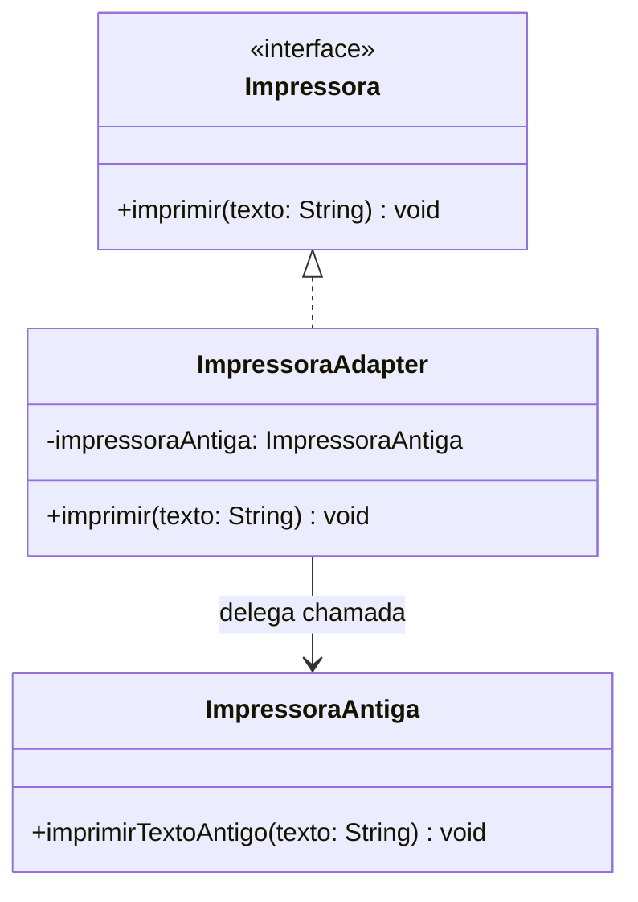

# Adapter Pattern

> Padrão estrutural que permite que classes com interfaces incompatíveis trabalhem juntas, criando uma "ponte" que traduz chamadas de um formato para outro — sem alterar o código original.

---

## 🎯 O problema que ele resolve

Imagine que seu sistema define um contrato simples para impressão:

```java
public interface Impressora {
    void imprimir(String texto);
}
```

Mas você precisa reaproveitar uma classe legada, `ImpressoraAntiga`, que já existe há anos, é usada em outras partes do sistema e **não pode ser alterada**:

```java
public class ImpressoraAntiga {
    public void imprimirTextoAntigo(String texto) {
        System.out.println("[ANTIGA] " + texto);
    }
}
```

O problema é claro: o método se chama `imprimirTextoAntigo`, não `imprimir`. Seu sistema não consegue tratar essa classe como uma `Impressora` comum — as assinaturas são incompatíveis.

**Soluções ruins que costumam aparecer aqui:**
- Reescrever a classe antiga (arriscado, pode quebrar outros pontos do sistema que dependem dela).
- Duplicar a lógica dentro de uma nova classe (gera código repetido e difícil de manter).
- Encher o sistema de `if/instanceof` verificando o tipo do objeto para chamar o método certo (frágil e feio).

---

## ✅ A solução com Adapter

Cria-se uma classe intermediária — o **Adapter** — que implementa a interface que o sistema espera (`Impressora`) e, por dentro, delega a chamada para a classe antiga, traduzindo o formato.

Ninguém precisa mexer na classe legada. Ninguém precisa mudar o contrato do sistema. O Adapter é a única peça nova.

### Analogia

É o mesmo princípio de um adaptador de tomada de viagem: o plugue do aparelho (classe antiga) tem um formato, a tomada da parede (o que o sistema espera) tem outro. O adaptador não muda nenhum dos dois — ele só faz a tradução entre eles.

---

## 🧩 Participantes do padrão

| Papel | Neste exemplo | Responsabilidade |
|---|---|---|
| **Target** (interface) | `Impressora` | Contrato que o sistema conhece e espera |
| **Adaptee** | `ImpressoraAntiga` | Classe existente, incompatível, que não pode ser alterada |
| **Adapter** | `ImpressoraAdapter` | Implementa o Target e traduz a chamada para o Adaptee |
| **Client** | `Main` | Usa a interface `Impressora`, sem saber o que existe por trás |

### Diagrama



---

## 💻 Código

**Target — a interface que o sistema espera**

```java
public interface Impressora {
    void imprimir(String texto);
}
```

**Adaptee — a classe existente, incompatível**

```java
public class ImpressoraAntiga {
    public void imprimirTextoAntigo(String texto) {
        System.out.println("[ANTIGA] " + texto);
    }
}
```

**Adapter — a ponte entre os dois**

```java
public class ImpressoraAdapter implements Impressora {

    private ImpressoraAntiga impressoraAntiga;

    public ImpressoraAdapter(ImpressoraAntiga impressoraAntiga) {
        this.impressoraAntiga = impressoraAntiga;
    }

    @Override
    public void imprimir(String texto) {
        impressoraAntiga.imprimirTextoAntigo(texto);
    }
}
```

**Client**

```java
public class Main {
    public static void main(String[] args) {
        ImpressoraAntiga impressoraAntiga = new ImpressoraAntiga();
        Impressora impressora = new ImpressoraAdapter(impressoraAntiga);

        impressora.imprimir("Relatório mensal de vendas");
    }
}
```

> 💡 Ajuste os trechos acima para bater exatamente com a implementação que você escreveu.

---

## 🔍 O que muda, na prática

| Sem Adapter | Com Adapter |
|---|---|
| Sistema precisa conhecer a assinatura específica da classe legada | Sistema conhece apenas a interface `Impressora` |
| Alterar a classe legada é arriscado e pode quebrar outras partes | Classe legada permanece intocada |
| Código cheio de verificações de tipo (`instanceof`) | Uma única classe nova concentra toda a tradução |
| Difícil reaproveitar código antigo em contexto novo | Reaproveitamento limpo, sem duplicação |

---

## 🧠 Quando usar

- Quando você precisa integrar uma classe existente (legada, de terceiros, de uma lib externa) cuja interface não é compatível com o que seu sistema espera.
- Quando **não é possível ou não é desejável** alterar a classe original.
- Quando você quer isolar, em um único lugar, toda a lógica de "tradução" entre dois formatos diferentes.

## ⚠️ Quando evitar

- Se você **tem controle total** sobre a classe "incompatível" e pode simplesmente ajustá-la para seguir o contrato esperado — nesse caso, o Adapter é uma camada desnecessária.
- Se a tradução entre os formatos for tão complexa que o Adapter passa a conter regras de negócio — sinal de que o problema é maior do que uma simples incompatibilidade de interface.

---

## 📚 Referências

- Design Patterns: Elements of Reusable Object-Oriented Software — Gang of Four (GoF)
- [Refactoring.Guru — Adapter](https://refactoring.guru/design-patterns/adapter)

